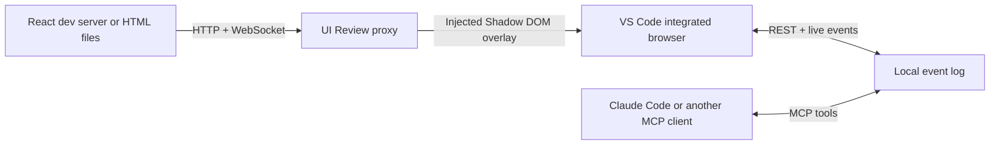

# UI Review

UI Review adds a polished visual feedback layer to any local web app without changing that app. Open the review URL in VS Code, select a DOM element or draw a free-form area, and discuss the note with Claude Code in the same thread.

It is designed for remote development over SSH: the proxy, feedback store, and coding agent all run on the Linux host, while the interface opens through VS Code's integrated Chromium browser. No Edge extension is required.

## What works

- React, Vite, and other development servers through an HTTP and WebSocket proxy
- Built HTML sites, individual HTML files, and static directories
- Element selection with selector, DOM path, text, accessibility, layout, and style context
- Free-form rectangular area feedback
- Threaded reviewer and agent replies with live updates
- `open`, `in_progress`, `review`, and `resolved` states
- Local append-only storage in `.ui-review/events.jsonl`
- A generic MCP server plus a Claude Code `/review-feedback` skill
- Multiple reviewed apps in one repository without comment collisions

## Try the included fixtures

Requirements: Node.js 20 or newer and npm.

```bash
npm install
npm run build
```

Start the React fixture in one terminal:

```bash
npm run dev:react
```

Start UI Review in a second terminal:

```bash
node packages/ui-review/dist/cli.js http://127.0.0.1:5173 --app react-fixture
```

Open `http://127.0.0.1:4317` with **Browser: Open Integrated Browser** in VS Code. With Remote SSH, accept VS Code's port-forwarding prompt if it appears.

The small violet button opens the toolbar. Choose **Element** to target a rendered element or **Area** to draw anywhere on the page. Submit a comment, then run `/review-feedback` in Claude Code. Agent replies and status changes appear in the open thread without a reload.

## Use it with an existing app

For React or another framework, keep the normal development server running and pass its URL:

```bash
npx ui-review http://127.0.0.1:3000 --app product-ui
```

UI Review forwards normal requests and development WebSockets, so Vite-style hot reload continues to work through the review URL.

For a built site or plain HTML file, pass a directory or file instead:

```bash
npx ui-review ./dist --app marketing-site
npx ui-review ./prototype.html --app prototype
```

The `--app` value keeps annotations separate when several apps use the same route. If omitted, UI Review derives a stable identity from the target URL or absolute path.

Useful options:

```text
--port <number>   Review port, default 4317
--host <address>  Bind address, default 127.0.0.1
--root <path>     Project root for .ui-review data, default current directory
--app <name>      Stable application identity
```

Keep the default loopback host for SSH development. VS Code forwards the port through the authenticated SSH connection, so the review server does not need to be exposed publicly.

## Connect Claude Code

This repository includes [.mcp.json](./.mcp.json) and the project skill at [.claude/skills/review-feedback/SKILL.md](./.claude/skills/review-feedback/SKILL.md). After building the package, approve the project MCP server when Claude Code prompts for trust, then invoke:

```text
/review-feedback
```

The MCP server gives any compatible coding agent five typed tools:

- `ui_review_list_annotations`
- `ui_review_get_annotation`
- `ui_review_set_status`
- `ui_review_reply`
- `ui_review_delete_annotation`

The skill tells Claude to acknowledge an item, make a scoped change, verify it, reply in the thread, and move it to **Ready for review**. Only the human reviewer marks it **Resolved**.

For another project, copy the skill and configure the MCP command to point to the installed `ui-review` binary:

```json
{
  "mcpServers": {
    "ui-review": {
      "type": "stdio",
      "command": "npx",
      "args": ["-y", "ui-review", "mcp", "--root", "."]
    }
  }
}
```

## Architecture



The reverse proxy keeps review code out of the target application and makes the browser client same-origin. All reviewer and agent text is rendered with DOM text nodes, never inserted as HTML.

## Development

```bash
npm run check
npm test
npm run build
```

The product code uses strict TypeScript. Browser flows are tested against both fixtures with a real Chromium session.

The detailed trade-offs and delivery plan live in [docs/implementation-plan.md](./docs/implementation-plan.md).

## Current scope

The first release is local-first and intended for one reviewer plus one coding-agent session. Authentication, shared cloud deployments, simultaneous reviewers, screenshot attachments, and framework-specific source maps are deliberately deferred.

## License

MIT
