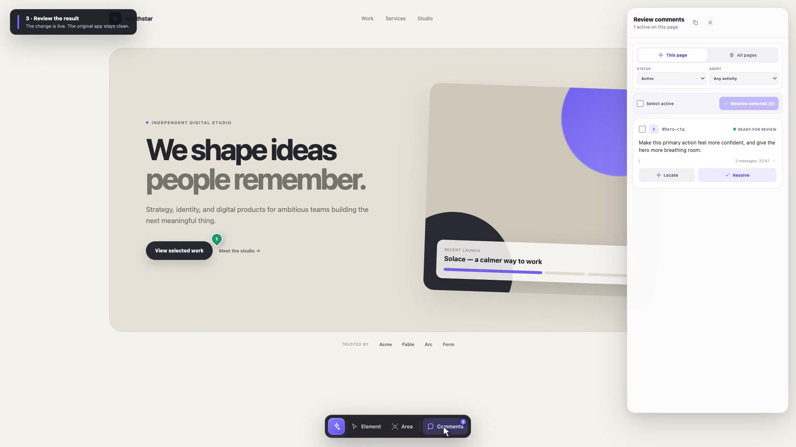
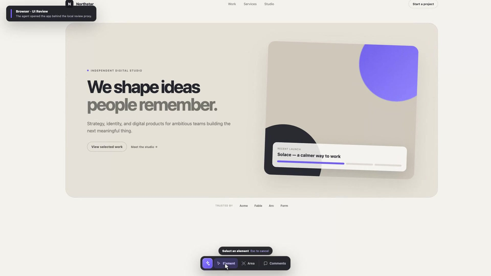
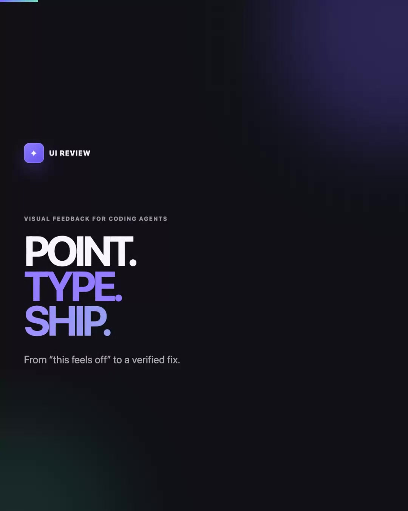
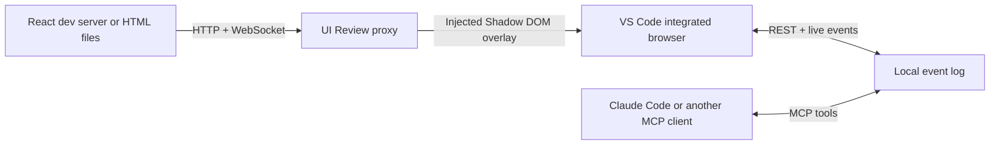

# UI Review

UI Review adds a polished visual feedback layer to any local web app without changing that app. Open the review URL in VS Code, select a DOM element or draw a free-form area, and discuss the note with Claude Code in the same thread.

It is designed for remote development over SSH: the proxy, feedback store, and coding agent all run on the Linux host, while the interface opens through VS Code's integrated Chromium browser. No Edge extension is required.

## Demo

### Product tour — 54 seconds

[](./docs/demo/ui-review-demo.mp4)

**[Watch the concise product tour](./docs/demo/ui-review-demo.mp4)** — launch a review, pin visual feedback, let the agent implement it, and approve the live result.

### Full human–agent workflow — 1 minute 29 seconds

[](./docs/demo/ui-review-full-workflow.mp4)

**[Watch the complete workflow](./docs/demo/ui-review-full-workflow.mp4)** — a human starts UI Review in Claude Code, switches to the browser to annotate the page, hands the note back to the coding agent, watches the implementation, and resolves the verified result.

### Social teaser — 12 seconds

<table>
  <tr>
    <td width="38%"><a href="./docs/demo/ui-review-social-teaser.mp4"></a></td>
    <td><strong>Fast 4:5 social cut</strong><br>Designed for LinkedIn, Instagram, and X feeds. The complete workflow is compressed into a text-first, sound-off-friendly teaser.<br><br><a href="./docs/demo/ui-review-social-teaser.mp4">Watch the social teaser</a></td>
  </tr>
</table>

All formats and recommended uses are listed in the **[video library](./docs/demo/README.md)**.


The same review layer works with React applications and responsive layouts.

<table>
  <tr>
    <td width="70%"></td>
    <td width="30%"></td>
  </tr>
  <tr>
    <td align="center"><sub>React desktop</sub></td>
    <td align="center"><sub>Responsive mobile</sub></td>
  </tr>
</table>

## What works

- React, Vite, and other development servers through an HTTP and WebSocket proxy
- Built HTML sites, individual HTML files, and static directories
- Element selection with selector, DOM path, text, accessibility, layout, and style context
- Free-form rectangular area feedback
- Uninterrupted quick annotation: the selected tool stays active while threads remain closed until explicitly opened
- PNG, JPEG, and WebP screenshot attachments through file selection or clipboard paste
- Compact pin previews plus target location, missing-target detection, and re-anchoring
- Threaded reviewer and agent replies with live updates
- Editable initial comments and ready-to-paste agent instructions with screenshot paths
- Current-page and app-wide review views with route, status, and agent-activity filters
- One-click Resolve/Reopen actions and bulk resolution from the comments overview
- `open`, `in_progress`, `review`, and `resolved` states
- Local append-only storage in `.ui-review/events.jsonl`
- A generic MCP server plus Claude Code skills for starting, processing, and stopping reviews
- Atomic annotation claims and isolated process records for parallel Claude Code or Codex windows
- Multiple reviewed apps in one repository without comment collisions
- React Router, hash routing, and separate feedback per application route

## Try the included fixtures

Requirements: Node.js 20 or newer and npm.

```bash
npm install
npm run build
```

Start the React fixture in one terminal:

```bash
npm run dev:react
```

Start UI Review in a second terminal:

```bash
node packages/ui-review/dist/cli.js http://127.0.0.1:5173 --app react-fixture
```

Open `http://127.0.0.1:4317` with **Browser: Open Integrated Browser** in VS Code. With Remote SSH, accept VS Code's port-forwarding prompt if it appears.

The small violet button opens the toolbar. Choose **Element** to target a rendered element or **Area** to draw anywhere on the page. After submission, the thread stays closed and the selected tool remains active so you can continue annotating; press **Esc** to stop. Hover or focus a pin for a compact preview, and click it only when you want the full thread. Screenshots can be selected or pasted directly into the composer. Agent replies and status changes appear without a reload. As a standalone alternative, open **Comments** and use the copy icon in the panel header to copy every visible active annotation as a ready-to-paste implementation instruction.

## Use it with an existing app

For React or another framework, keep the normal development server running and pass its URL:

```bash
npx ui-review http://127.0.0.1:3000 --app product-ui
```

UI Review forwards normal requests and development WebSockets, so Vite-style hot reload continues to work through the review URL.

React applications can contain any number of pages. UI Review separates annotations by `pathname` and query string and notices client-side route changes automatically. Comments on `/dashboard`, `/settings`, and `/users/42` therefore remain independent. Hash routers are supported with `--include-hash`. Direct route reloads work whenever the underlying development server or static SPA fallback serves that route.

For a built site or plain HTML file, pass a directory or file instead:

```bash
npx ui-review ./dist --app marketing-site
npx ui-review ./prototype.html --app prototype
```

The `--app` value keeps annotations separate when several apps use the same route. If omitted, UI Review derives a stable identity from the target URL or absolute path.

Ordinary document anchors such as `#pricing` stay attached to the current page by default. For applications that use the URL hash as an actual router, add `--include-hash` to keep each hash route independent.

Useful options:

```text
--port <number>   Review port, default 4317
--host <address>  Bind address, default 127.0.0.1
--root <path>     Project root for .ui-review data, default current directory
--app <name>      Stable application identity
--include-hash    Treat URL hash changes as separate routes
```

Keep the default loopback host for SSH development. VS Code forwards the port through the authenticated SSH connection, so the review server does not need to be exposed publicly.

## Set up UI Review in Claude Code

This section assumes Claude Code is already available and covers only the UI Review skill and MCP integration. Run these commands on the same machine where Claude Code and the reviewed project run. With VS Code Remote SSH, that is normally the remote Linux host.

Requirements: Node.js 20 or newer, npm, Git, and an existing Claude Code installation.

### Personal setup for all projects

Clone UI Review and run its installer:

```bash
git clone https://github.com/flucas96/ui-review.git
cd ui-review
npm ci
npm run install:claude
```

The installer:

- Packs and installs the `ui-review` CLI globally without depending on the cloned directory afterward.
- Synchronizes `start-ui-review`, `review-feedback`, `stop-ui-review`, and `update-ui-review` to `~/.claude/skills/`.
- Adds a user-scoped `ui-review` MCP server that automatically uses Claude Code's active project directory.
- Records the checkout path and installer choices in `~/.ui-review/installation.json` so later updates use the same setup.

It updates only UI Review's personal skills and MCP entry. It does not install or reconfigure Claude Code itself.

### Verify the setup

Check the CLI and MCP connection:

```bash
ui-review --version
claude mcp get ui-review
```

The first command should print `0.4.0`. The MCP result should show:

```text
Scope: User config (available in all your projects)
Status: ✓ Connected
Command: ui-review
Args: mcp
```

The following personal skill files should now exist:

```text
~/.claude/skills/start-ui-review/SKILL.md
~/.claude/skills/review-feedback/SKILL.md
~/.claude/skills/stop-ui-review/SKILL.md
~/.claude/skills/update-ui-review/SKILL.md
```

If the personal skills directory was created for the first time, restart the current Claude Code session once so the new slash commands appear.

### Run the first review

Open the project you want to review and start Claude Code there:

```bash
cd /path/to/your/project
claude
```

Then use this workflow inside Claude Code:

```text
/start-ui-review
```

Claude detects plain HTML or the existing framework command, starts the app when necessary, launches the loopback-only review proxy, and returns the review URL. Open that URL in the VS Code integrated browser and add annotations.

Ask Claude to implement the open feedback:

```text
/review-feedback
```

Claude claims each selected annotation through MCP, moves it to **In progress**, implements and verifies the change, replies in its thread, and moves it to **Ready for review**. The claim is then released. Only the human reviewer marks an annotation **Resolved**.

When the review session is finished, stop only its managed processes:

```text
/stop-ui-review
```

The stop skill targets the session ID returned by `/start-ui-review`, preserves `.ui-review/events.jsonl`, and leaves development servers running when that session did not start them.

### Use multiple Claude Code windows safely

Multiple Claude Code or Codex windows may use the same project concurrently. Each MCP process derives a distinct local agent-session identity. Before an agent can change a thread, status, or deletion state, it must atomically claim that annotation. A second window sees `another_session` and cannot mutate the item until the first window releases it or its 30-minute lease expires.

Review proxy processes are isolated separately:

- `/start-ui-review` generates a review session UUID and asks the operating system for a free port with `--port 0`.
- Process metadata and logs live under `.ui-review/sessions/<session-id>.*`.
- `/stop-ui-review` stops only the session ID from the current conversation. If several sessions exist and no ID is known, it asks which one to stop.
- Different projects continue to use independent `.ui-review` directories. Different apps in one project share the event store but remain separated by `appId`.

If an agent window closes unexpectedly, its proxy process remains manageable through the recorded review session and its annotation claims expire automatically. There is deliberately no silent claim takeover.

### Verify MCP tools when feedback cannot be loaded

The MCP server exposes these seven tools:

- `ui_review_list_annotations`
- `ui_review_get_annotation`
- `ui_review_claim_annotation`
- `ui_review_release_annotation`
- `ui_review_set_status`
- `ui_review_reply`
- `ui_review_delete_annotation`

If Claude reports that the MCP server is connected but cannot discover these tools:

- Stop the current `/review-feedback` attempt.
- Open `/mcp`, select `ui-review`, and choose **Reconnect**.
- Run `/review-feedback` again. If discovery still fails, restart Claude Code in the project once.

`ListMcpResources` returning `No resources found` is expected because UI Review exposes MCP tools, not MCP resources. Do not use direct edits to `.ui-review/events.jsonl` as a fallback; replies and lifecycle changes should go through the MCP tools.

### Update UI Review

For a normal personal installation, invoke the update directly inside Claude Code:

```text
/update-ui-review
```

The skill reads the recorded checkout path and runs the complete update there. The equivalent terminal command, run inside the UI Review checkout, is:

```bash
npm run update:claude
```

The updater performs a fast-forward-only Git pull, reinstalls locked dependencies, rebuilds and globally installs the CLI, refreshes all four skills, and recreates the user-scoped MCP entry. It preserves custom installer choices such as `--target`, `--skip-cli`, and `--skip-mcp`.

The updater never resets, stashes, or overwrites local repository changes. If the checkout has conflicting edits or a divergent branch, it stops and asks you to preserve those changes explicitly. Project feedback under `.ui-review/` is not part of the tool checkout and is never touched.

After a successful update, restart any running Claude Code session. This reloads both the updated skill instructions and the new MCP tool schema. Then verify:

```bash
ui-review --version
claude mcp get ui-review
```

If only the MCP server needs refreshing, open `/mcp`, choose `ui-review`, and reconnect it. A full Claude Code restart is still recommended after skill updates.

### Installer options

The initial installer accepts these options:

```text
--dry-run         Show planned changes
--target <path>   Install skills somewhere other than ~/.claude/skills
--skip-cli        Synchronize skills without installing the global CLI
--skip-mcp        Leave Claude Code's user MCP configuration unchanged
```

For a team-shared project setup instead of a personal installation, make sure `ui-review` is available on each contributor's `PATH`, then commit the desired directories from `.claude/skills/` and this `.mcp.json` equivalent:

```json
{
  "mcpServers": {
    "ui-review": {
      "type": "stdio",
      "command": "ui-review",
      "args": ["mcp"]
    }
  }
}
```

## Connect Codex

This repository includes the project MCP configuration at [.codex/config.toml](./.codex/config.toml) and the reusable skill at [.agents/skills/review-feedback/SKILL.md](./.agents/skills/review-feedback/SKILL.md).

Build the package, open the repository as a trusted Codex project, and restart Codex once after cloning:

```bash
npm ci
npm run build --workspace ui-review
```

In Codex, run `/mcp` and verify that `ui-review` is connected. Process feedback by mentioning `$review-feedback` or asking Codex to address the open UI Review comments. Codex can also select the skill automatically when the request clearly refers to visual annotations.

The Codex app, CLI, and IDE extension share the project MCP configuration on the same host. Cloud tasks cannot read the local `.ui-review/events.jsonl`; use a local Codex task for the current MVP.

## Architecture



The reverse proxy keeps review code out of the target application and makes the browser client same-origin. All reviewer and agent text is rendered with DOM text nodes, never inserted as HTML.

### Agent data and event-log size

`.ui-review/events.jsonl` is the local append-only history. It contains complete target metadata plus status and message events so discussions remain recoverable, but the MCP server does not send that whole file to an agent. Screenshot bytes are stored separately under `.ui-review/attachments/`; events retain only validated metadata.

Agent reads are deliberately progressive:

- `ui_review_list_annotations` returns compact summaries: ID, status, route, short initial comment, message count, and a minimal target reference.
- `ui_review_get_annotation` returns full DOM or region context and project-relative screenshot paths only for the one annotation the agent is about to process. Persistence-only message IDs and timestamps are omitted.
- Claim information exposes only `this_session` or `another_session`; raw agent-session identifiers are never sent in annotation results.
- Status changes, replies, and deletions return small acknowledgements instead of repeating the annotation.

This keeps the durable history intact while preventing a review with many annotations from consuming the agent context all at once. Agents should filter the list to `open` and `in_progress`, then load selected items individually.

When an upstream development server sends a strict HTTP Content Security Policy, the proxy generates a per-response nonce for the injected module and isolated overlay styles and permits same-origin review API connections. CSP declared only through an HTML `<meta>` tag is not rewritten in the current release.

## Development

```bash
npm run check
npm test
npm run build
```

The product code uses strict TypeScript. Browser flows are tested against both fixtures with a real Chromium session.

The detailed trade-offs and delivery plan live in [docs/implementation-plan.md](./docs/implementation-plan.md).

## Current scope

The current release is local-first and supports one reviewer with multiple coordinated local coding-agent windows. Authentication, shared cloud deployments, simultaneous human reviewers, automatic browser screen capture, and framework-specific source maps are deliberately deferred.

## License

MIT
