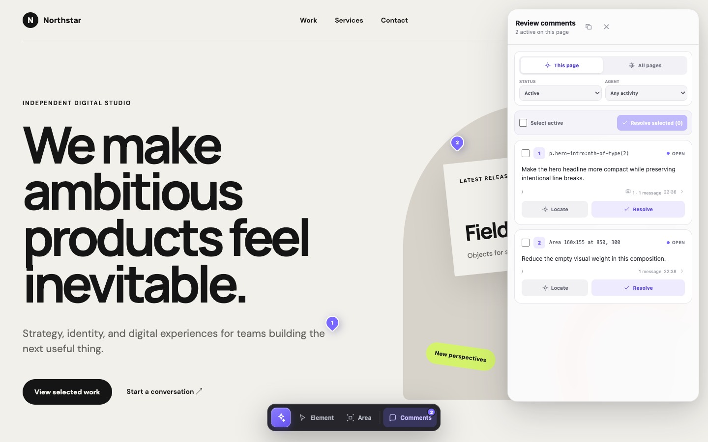
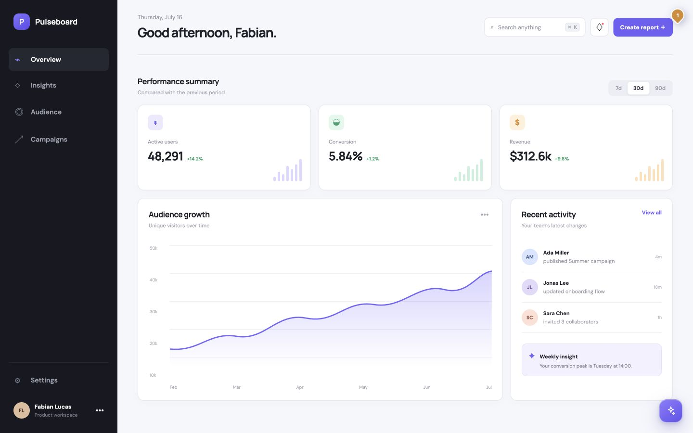
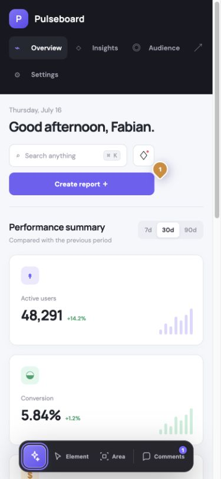
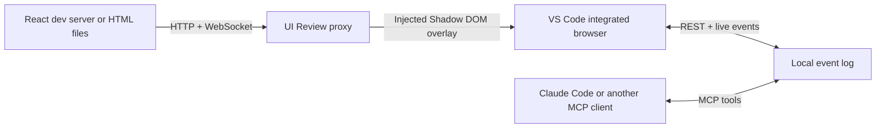

# UI Review

UI Review adds a polished visual feedback layer to any local web app without changing that app. Open the review URL in VS Code, select a DOM element or draw a free-form area, and discuss the note with Claude Code in the same thread.

It is designed for remote development over SSH: the proxy, feedback store, and coding agent all run on the Linux host, while the interface opens through VS Code's integrated Chromium browser. No Edge extension is required.

## Demo

Select an element or draw an area, leave a comment, and manage the resulting review threads without modifying the app being reviewed.



The same review layer works with React applications and responsive layouts.

<table>
  <tr>
    <td width="70%"></td>
    <td width="30%"></td>
  </tr>
  <tr>
    <td align="center"><sub>React desktop</sub></td>
    <td align="center"><sub>Responsive mobile</sub></td>
  </tr>
</table>

## What works

- React, Vite, and other development servers through an HTTP and WebSocket proxy
- Built HTML sites, individual HTML files, and static directories
- Element selection with selector, DOM path, text, accessibility, layout, and style context
- Free-form rectangular area feedback
- Threaded reviewer and agent replies with live updates
- One-click Resolve/Reopen actions and bulk resolution from the comments overview; resolved items are archived behind Show resolved
- `open`, `in_progress`, `review`, and `resolved` states
- Local append-only storage in `.ui-review/events.jsonl`
- A generic MCP server plus Claude Code skills for starting, processing, and stopping reviews
- Multiple reviewed apps in one repository without comment collisions
- React Router, hash routing, and separate feedback per application route

## Try the included fixtures

Requirements: Node.js 20 or newer and npm.

```bash
npm install
npm run build
```

Start the React fixture in one terminal:

```bash
npm run dev:react
```

Start UI Review in a second terminal:

```bash
node packages/ui-review/dist/cli.js http://127.0.0.1:5173 --app react-fixture
```

Open `http://127.0.0.1:4317` with **Browser: Open Integrated Browser** in VS Code. With Remote SSH, accept VS Code's port-forwarding prompt if it appears.

The small violet button opens the toolbar. Choose **Element** to target a rendered element or **Area** to draw anywhere on the page. Submit a comment, then run `/review-feedback` in Claude Code. Agent replies and status changes appear in the open thread without a reload.

## Use it with an existing app

For React or another framework, keep the normal development server running and pass its URL:

```bash
npx ui-review http://127.0.0.1:3000 --app product-ui
```

UI Review forwards normal requests and development WebSockets, so Vite-style hot reload continues to work through the review URL.

React applications can contain any number of pages. UI Review separates annotations by `pathname` and query string and notices client-side route changes automatically. Comments on `/dashboard`, `/settings`, and `/users/42` therefore remain independent. Hash routers are supported with `--include-hash`. Direct route reloads work whenever the underlying development server or static SPA fallback serves that route.

For a built site or plain HTML file, pass a directory or file instead:

```bash
npx ui-review ./dist --app marketing-site
npx ui-review ./prototype.html --app prototype
```

The `--app` value keeps annotations separate when several apps use the same route. If omitted, UI Review derives a stable identity from the target URL or absolute path.

Ordinary document anchors such as `#pricing` stay attached to the current page by default. For applications that use the URL hash as an actual router, add `--include-hash` to keep each hash route independent.

Useful options:

```text
--port <number>   Review port, default 4317
--host <address>  Bind address, default 127.0.0.1
--root <path>     Project root for .ui-review data, default current directory
--app <name>      Stable application identity
--include-hash    Treat URL hash changes as separate routes
```

Keep the default loopback host for SSH development. VS Code forwards the port through the authenticated SSH connection, so the review server does not need to be exposed publicly.

## Set up UI Review in Claude Code

This section assumes Claude Code is already available and covers only the UI Review skill and MCP integration. Run these commands on the same machine where Claude Code and the reviewed project run. With VS Code Remote SSH, that is normally the remote Linux host.

Requirements: Node.js 20 or newer, npm, Git, and an existing Claude Code installation.

### Personal setup for all projects

Clone UI Review and run its installer:

```bash
git clone https://github.com/flucas96/ui-review.git
cd ui-review
npm ci
npm run install:claude
```

The installer:

- Packs and installs the `ui-review` CLI globally without depending on the cloned directory afterward.
- Synchronizes `start-ui-review`, `review-feedback`, and `stop-ui-review` to `~/.claude/skills/`.
- Adds a user-scoped `ui-review` MCP server that automatically uses Claude Code's active project directory.

It updates only UI Review's personal skills and MCP entry. It does not install or reconfigure Claude Code itself.

### Verify the setup

Check the CLI and MCP connection:

```bash
ui-review --version
claude mcp get ui-review
```

The first command should print `0.1.0`. The MCP result should show:

```text
Scope: User config (available in all your projects)
Status: ✓ Connected
Command: ui-review
Args: mcp
```

The following personal skill files should now exist:

```text
~/.claude/skills/start-ui-review/SKILL.md
~/.claude/skills/review-feedback/SKILL.md
~/.claude/skills/stop-ui-review/SKILL.md
```

If the personal skills directory was created for the first time, restart the current Claude Code session once so the new slash commands appear.

### Run the first review

Open the project you want to review and start Claude Code there:

```bash
cd /path/to/your/project
claude
```

Then use this workflow inside Claude Code:

```text
/start-ui-review
```

Claude detects plain HTML or the existing framework command, starts the app when necessary, launches the loopback-only review proxy, and returns the review URL. Open that URL in the VS Code integrated browser and add annotations.

Ask Claude to implement the open feedback:

```text
/review-feedback
```

Claude reads annotations through MCP, moves accepted work to **In progress**, implements and verifies the changes, replies in each thread, and moves completed items to **Ready for review**. Only the human reviewer marks an annotation **Resolved**.

When the review session is finished, stop only its managed processes:

```text
/stop-ui-review
```

The stop skill preserves `.ui-review/events.jsonl` and leaves development servers running when it did not start them.

### Verify MCP tools when feedback cannot be loaded

The MCP server exposes these five tools:

- `ui_review_list_annotations`
- `ui_review_get_annotation`
- `ui_review_set_status`
- `ui_review_reply`
- `ui_review_delete_annotation`

If Claude reports that the MCP server is connected but cannot discover these tools:

- Stop the current `/review-feedback` attempt.
- Open `/mcp`, select `ui-review`, and choose **Reconnect**.
- Run `/review-feedback` again. If discovery still fails, restart Claude Code in the project once.

`ListMcpResources` returning `No resources found` is expected because UI Review exposes MCP tools, not MCP resources. Do not use direct edits to `.ui-review/events.jsonl` as a fallback; replies and lifecycle changes should go through the MCP tools.

### Installer maintenance and options

Run the installer again after pulling a newer UI Review version:

```bash
git pull
npm ci
npm run install:claude
```

Available options:

```text
--dry-run         Show planned changes
--target <path>   Install skills somewhere other than ~/.claude/skills
--skip-cli        Synchronize skills without installing the global CLI
--skip-mcp        Leave Claude Code's user MCP configuration unchanged
```

For a team-shared project setup instead of a personal installation, make sure `ui-review` is available on each contributor's `PATH`, then commit the desired directories from `.claude/skills/` and this `.mcp.json` equivalent:

```json
{
  "mcpServers": {
    "ui-review": {
      "type": "stdio",
      "command": "ui-review",
      "args": ["mcp"]
    }
  }
}
```

## Connect Codex

This repository includes the project MCP configuration at [.codex/config.toml](./.codex/config.toml) and the reusable skill at [.agents/skills/review-feedback/SKILL.md](./.agents/skills/review-feedback/SKILL.md).

Build the package, open the repository as a trusted Codex project, and restart Codex once after cloning:

```bash
npm ci
npm run build --workspace ui-review
```

In Codex, run `/mcp` and verify that `ui-review` is connected. Process feedback by mentioning `$review-feedback` or asking Codex to address the open UI Review comments. Codex can also select the skill automatically when the request clearly refers to visual annotations.

The Codex app, CLI, and IDE extension share the project MCP configuration on the same host. Cloud tasks cannot read the local `.ui-review/events.jsonl`; use a local Codex task for the current MVP.

## Architecture



The reverse proxy keeps review code out of the target application and makes the browser client same-origin. All reviewer and agent text is rendered with DOM text nodes, never inserted as HTML.

When an upstream development server sends a strict HTTP Content Security Policy, the proxy generates a per-response nonce for the injected module and isolated overlay styles and permits same-origin review API connections. CSP declared only through an HTML `<meta>` tag is not rewritten in the current release.

## Development

```bash
npm run check
npm test
npm run build
```

The product code uses strict TypeScript. Browser flows are tested against both fixtures with a real Chromium session.

The detailed trade-offs and delivery plan live in [docs/implementation-plan.md](./docs/implementation-plan.md).

## Current scope

The first release is local-first and intended for one reviewer plus one coding-agent session. Authentication, shared cloud deployments, simultaneous reviewers, screenshot attachments, and framework-specific source maps are deliberately deferred.

## License

MIT
